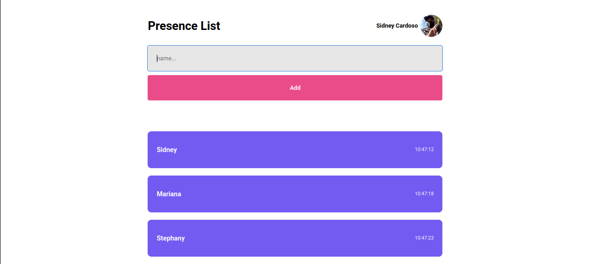

# Fundamentos React

Neste repositório será colocado todo o meu aprendizado de React com a RocketSeat

Aqui está o resultado do projeto:

<p align="center">

</p>

<h2>Executando o projeto:</h2>


-   Para instalar as dependências basta colocar em seu terminal :

```bash
yarn
```

-   Para executar o projeto:

```bash
yarn dev
```
